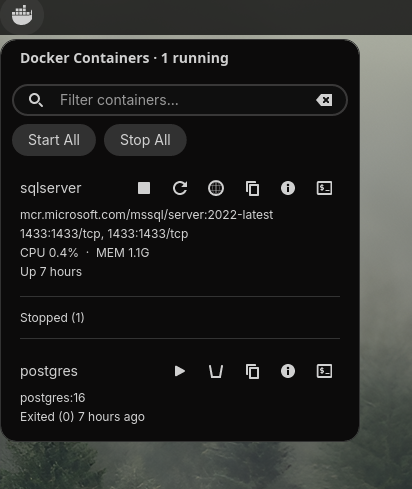
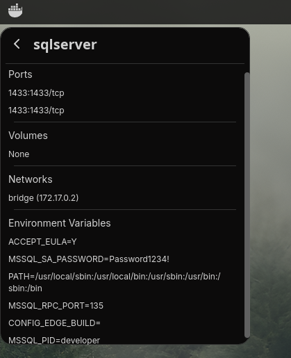
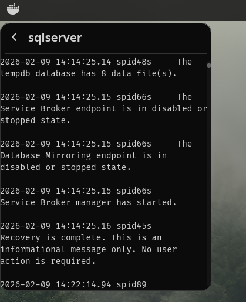

# cosmic-applet-docker

A panel applet for the [COSMIC desktop](https://github.com/pop-os/cosmic-epoch) that lets you monitor and manage Docker containers without leaving your workflow.





## Features

- **Panel indicator** with running container count
- **Live stats** — CPU and memory usage per container, updated every 3 seconds
- **Quick actions** — start, stop, restart, delete containers with one click
- **Streaming logs** — real-time log streaming with follow mode
- **Port mappings** — see published ports at a glance and open them in your browser
- **Docker Compose grouping** — containers are grouped by Compose project with collapsible sections and per-group start/stop
- **Bulk actions** — start all / stop all containers, or per Compose group
- **Search & filter** — quickly find containers by name or image
- **Health indicators** — green/yellow/red icons for containers with a HEALTHCHECK
- **Container details** — inspect ports, volumes, networks, and environment variables
- **Desktop notifications** — get notified when a container stops unexpectedly or becomes unhealthy
- **Copy container ID** — copy the short container ID to the clipboard
- **Uptime display** — see how long each container has been running

## Requirements

- COSMIC desktop environment
- Docker daemon running and accessible to the current user (i.e. user in the `docker` group, or rootless Docker)
- `wl-copy` (from `wl-clipboard`) for the Copy ID feature
- Rust toolchain and [just](https://github.com/casey/just) (to build from source)

## Install

```sh
git clone https://github.com/youruser/cosmic-applet-docker.git
cd cosmic-applet-docker
just build
sudo just install
```

Then add the applet to your panel through COSMIC Settings > Desktop > Panel > Applets.

To uninstall:

```sh
sudo just uninstall
```

## Usage

Click the applet icon in the panel to open the popup. Running containers show live CPU/memory stats, health status, port mappings, and uptime. Action buttons let you stop, restart, open in browser, copy the container ID, view details, or stream logs. Stopped containers can be started, deleted, or inspected.

Docker Compose projects are automatically grouped with collapsible headers and per-group start/stop controls. Use the search bar to filter containers by name or image, and bulk action buttons to start or stop everything at once.

The applet sends desktop notifications when a container stops unexpectedly or reports an unhealthy status, even when the popup is closed.





## License

GPL-3.0
